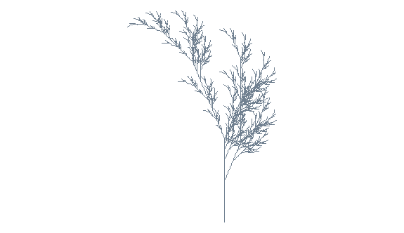
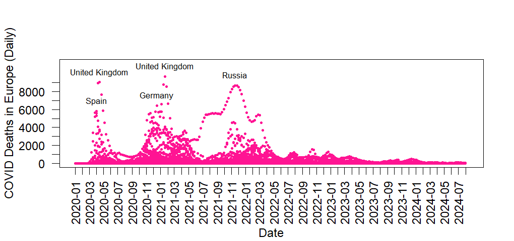

## EPPS6356 Data Visualization

### Assignment 1

#### Part 1 - Analysis of Anscombe's Article

<iframe src="Anscombe_Article_Analysis.pdf" width="100%" height="800px" style="border: 1px solid #ccc; border-radius: 8px;">

</iframe>

  

#### Part 2 - Fall.R Image

  

#### Part 3 - Critique of a Chart

<iframe src="Chart_Critique.pdf" width="100%" height="800px" style="border: 1px solid #ccc; border-radius: 8px;">

</iframe>

### Assignment 2

#### Part 1 - Murrell R Graphics Code Step-by-Step

<iframe src="Murrell_R_Graphics_Code_Stepbystep.pdf" width="100%" height="800px" style="border: 1px solid #ccc; border-radius: 8px;">

</iframe>

  

#### Parts 2 and 3 - Plotting Functions Using Happy Planet Index Data

<iframe src="Happy_Planet_Index_Data_Visualization.pdf" width="100%" height="800px" style="border: 1px solid #ccc; border-radius: 8px;">

</iframe>

### Assignment 3

#### Parts 1, 3, and 4 - Document a Chart, Fine-Tune Without Leaving Base R, Prepare in ggplot

<iframe src="Assignment03_Part1,3and4.pdf" width="100%" height="800px" style="border: 1px solid #ccc; border-radius: 8px;">

</iframe>

  

#### Part 2 - Anscombe's Quartet

<iframe src="Assignment03_Part2.pdf" width="100%" height="800px" style="border: 1px solid #ccc; border-radius: 8px;">

</iframe>

  

#### Pre-Hackathon Assignment

  

<iframe src="Assignment3_PrehackathonCode.pdf" width="100%" height="800px" style="border: 1px solid #ccc; border-radius: 8px;">

</iframe>

### Assignment 4

#### 48-Hour Chart Hackathon

<iframe src="Assignment4_ 48‑HourChart.pdf" width="100%" height="800px" style="border: 1px solid #ccc; border-radius: 8px;">

</iframe>

  

#### Hackathon Codes

<iframe src="Assignment4_Hackhaton_codes.pdf" width="100%" height="800px" style="border: 1px solid #ccc; border-radius: 8px;">

</iframe>